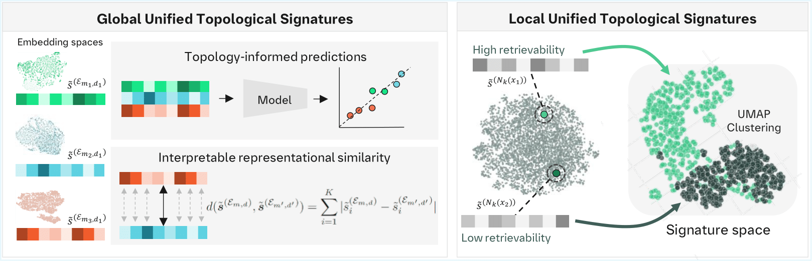

# Unified Topological Signatures




## Installation

### Dependencies and Modified MTEB version
We have created a MTEB fork with modifications to the Retrieval-Evaluation module. Make sure to install mteb from this Github repository: [Anonymized](https://github.com/) by running `pip install https://github.com/<anonymized-user>/mteb/archive/main.zip`.

In detail, we have modified `mteb/evaluation/evaluators/RetrievalEvaluator.py`such that:
- We store query and document embeddings related to retrievability
- We store a query's neighborhood documents (as a result of the dense retrieval computation)
- We store all hashes to be able to track an embedding back to its text and vice verca
- We compute document retrievability @ 100 for each query (i.e. we use the retrieval results to track the existence of each document)

Run `pip install -r requirements.txt` to install the remaining dependencies. For magnipy

### .env file
Create a .env file with the following entries:
```
MTEB_RESULTS_PATH=results/
METRICS_PATH=metric_results/
CACHE_PATH=embeddings/
```
It will be loaded automatically.


## Computing MTEB evaluations

### Running evaluations
The datasets used for the retrieval evaluation are configured in `config/eval.py`. Models are specified by their huggingface name consisting of institution/model_name. We provide a SLURM script to run all results in parallel (one job per model). To do so, execute `sh scripts/mteb.sh` in your console and all jobs will be scheduled. 

If you want to compute the results for a single model, you can also simply call the python script:
```
python compute_results.py --model <some-model-name>
``` 

### Adding custom models
In `utils/models.py` we provide a few examples for adding custom models from cloud platforms (e.g. self-hosted platforms, Databricks, google...). We use a prefix in the name to route the models to their corresponding model. We have also added basic error handling examples, such as context window overflow or hitting request rate limits. [Here](https://github.com/embeddings-benchmark/mteb/tree/main/mteb/models/model_implementations) you can find additional model implementations.

In addition, we provide a custom random model (prefix _random_), which allows to generate synthetic embeddings for any kind of analysis. Note that MTEB uses sentence-transformers as default choice when providing a model name.

### Embeddings cache
We use the class `CachedEmbeddingWrapper` to cache all computed embeddings at the cache location specified in the .env file. Running all experiments for all models and datasets results in a **lot of data (3.4 TB)**. To reduce the required disk space, you might want to exclude larger datasets (such as MTEB, ~8M embeddings) or use models with smaller embedding dimensions.


## Computing topological signatures

### Running computations
The file `config/metrics.py` specifies:
- Which topological measures to compute
- Which retrieval metrics to compute
- What arguments (e.g. max sample size) and seeds will be used
- Which distance functions to use
- How the signature vectors are constructed

We provide a SLURM script to run all metric computations in parallel (one job per model). To do so, execute `sh scripts/metrics.sh` in your console and all jobs will be scheduled. 

If you want to compute the metrics for a single model, you can also simply call the python script:
```
python compute_metrics.py --model <some-model-name>
``` 
The Python script will compute global signatures for documents and queries, signatures of the query neighborhood and signatures of documents with high and low retrievability. Important: The signatures will be computed for different sample sizes (up to the maximum size specified in the metrics config file).

## Compute CKA
The directory `cka` contains a script to compute the Centered Kernel Alignment between all models across all datasets. It results in a pairwise distance matrix per dataset, which will be saved as numpy array. 

# Notebooks
The plots and analyses are implemented in notebooks:
- `01_topological_signatures.ipynb`: Correlation plots, PCA analyses, predictive models, representational similarity.
- `02_collection_analysis.ipynb`: Collection performance prediction, retrieval performance correlation, UMAP clustering.
- `03_retrievability.ipynb`: Retrievability bias prediction, bias by architecture, embedding space vizualizations.
- `04_cka.ipynb`: Plots for Centered Kernel Alignment computations.
- `05_metrics_scaling.ipynb`: Time complexity and sample size robustness of metrics.
- `06_misc.ipynb`: Utility functions to compute UTS and check processing status.


We provide a dataframe with the data of the computed signatures for potential future analyses (`data/uts_data.csv`). To execute the notebooks completely, it however requires to compute all embeddings and run all experiments (by executing both `compute_results.py` and `compute_metrics.py`).


# Citation
```
Anonymized
```